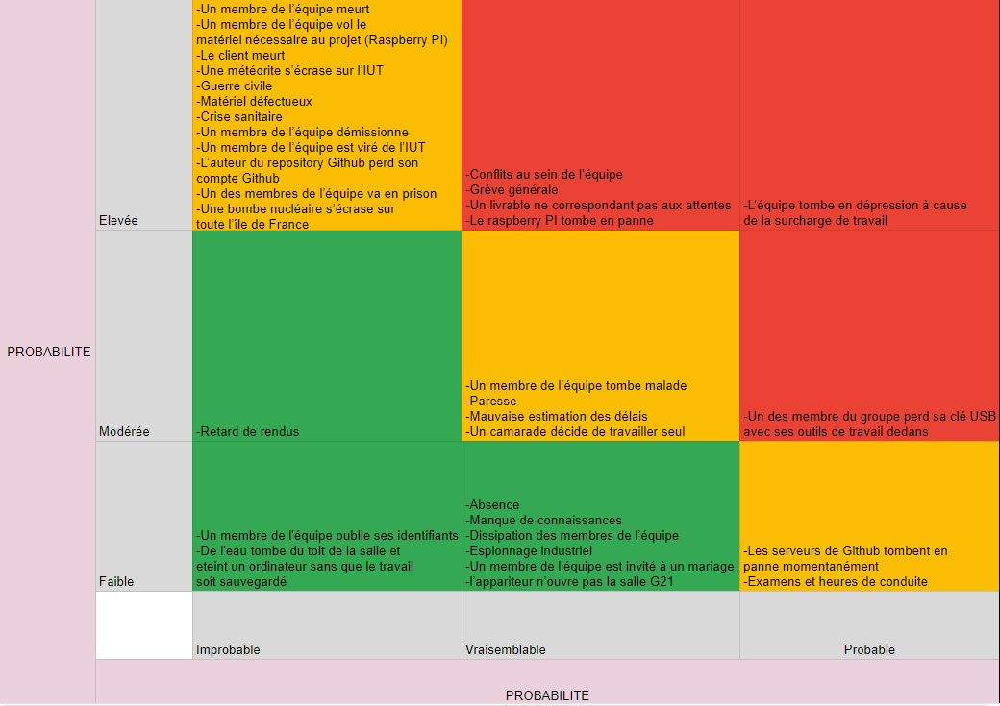

GRONDIN David 
CHOISY Alexis 
LÉAUTHAUD Matthieu 
MOUSSAMIH Elias 
DEGAT Teddy 
INFI2-B
# SAE3 - Gestion des risques
## L'analyse des risques
### Voci le tableau des différents risques :
| **Numéro** | **Risque**                                                                                     | **Probabilité** | **Répercussion** |
|------------|------------------------------------------------------------------------------------------------|-----------------|------------------|
| 1          | Un membre de l’équipe tombe malade                                                             | Vraisemblable   | Modérée          |
| 2          | Un membre de l’équipe meurt                                                                    | Improbable      | Elevée           |
| 3          | Conflits au sein de l’équipe                                                                   | Vraisemblable   | Elevée           |
| 4          | Paresse                                                                                        | Vraisemblable   | Modérée          |
| 5          | Absence                                                                                        | Vraisemblable   | Faible           |
| 6          | Manque de connaissances                                                                        | Vraisemblable   | Faible           |
| 7          | Retard de rendus                                                                               | Improbable      | Modérée          |
| 8          | Un membre de l’équipe vole le matériel nécessaire au projet (Raspberry PI)                     | Improbable      | Elevée           |
| 9          | Le client meurt                                                                                | Improbable      | Elevée           |
| 10         | Une météorite s’écrase sur l’IUT                                                               | Improbable      | Elevée           |
| 11         | Guerre civile                                                                                  | Improbable      | Elevée           |
| 12         | Les serveurs de Github tombent en panne momentanément                                          | Probable        | Faible           |
| 13         | Mauvaise estimation des délais                                                                 | Vraisemblable   | Modérée          |
| 14         | Grève générale                                                                                 | Vraisemblable   | Elevée           |
| 15         | Matériel défectueux                                                                            | Improbable      | Elevée           |
| 16         | Crise sanitaire                                                                                | Improbable      | Elevée           |
| 17         | Un membre de l’équipe quitte l’équipe                                                          | Improbable      | Elevée           |
| 18         | Un membre de l’équipe est exclu de l’IUT                                                       | Improbable      | Elevée           |
| 19         | L’auteur du repository Github perd son compte Github                                           | Improbable      | Elevée           |
| 20         | Dissipation des membres de l’équipe                                                            | Vraisemblable   | Faible           |
| 21         | Espionnage industriel                                                                          | Vraisemblable   | Faible           |
| 22         | L’équipe tombe en dépression à cause de la surcharge de travail                                | Probable        | Elevée           |
| 23         | Livrable ne correspondant pas aux attentes                                                     | Vraisemblable   | Elevée           |
| 24         | Le raspberry PI tombe en panne                                                                 | Vraisemblable   | Elevée           |
| 25         | Un des membres de l’équipe va en prison                                                        | Improbable      | Elevée           |
| 26         | Une bombe nucléaire s’écrase sur toute l’île de France                                         | Improbable      | Elevée           |
| 27         | Examens et heures de conduite                                                                  | Probable        | Faible           |
| 28         | Un membre de l'équipe est invité à un mariage                                                  | Vraisemblable   | Faible           |
| 29         | Un camarade décide de travailler seul                                                          | Vraisemblable   | Modérée          |
| 30         | Un des membre du groupe perd sa clé USB avec ses outils de travail dedans                      | Probable        | Modérée          |
| 31         | Un membre de l'équipe oublie ses identifiants                                                  | Improbable      | Faible           |
| 32         | L’appariteur n’ouvre pas la salle G21                                                          | Vraisemblable   | Faible           |
| 33         | De l'eau tombe du toit de la salle et eteint un ordinateur sans que le travail soit sauvegardé | Improbable      | Faible           |

### Voici la matrice liée aux risques ci-dessus : 

 
 
 
 
 

## Le contrôle des risques
**Un membre de l’équipe meurt :**
- *Stratégie de réponse :* Acceptation active.
- *Plan d'action :* Assurer le partage des connaissances et la mise à jour de la documentation du projet. Envisager un plan de relève si nécessaire.

**Un membre de l’équipe vole le matériel nécessaire au projet (Raspberry Pi) :**
- *Stratégie de réponse :* Atténuer.
- *Plan d'action :* Mettre en place des procédures de sécurité pour le stockage du matériel. Limiter l'accès au matériel aux membres autorisés et effectuer un suivi de l'inventaire.

**Le client meurt :**
- *Stratégie de réponse :* Atténuer.
- *Plan d'action :* Identifier un point de contact alternatif dans l'organisation du client. Établir des procédures de transition pour assurer la continuité du projet.

**Une météorite s’écrase sur l’IUT :**
- *Stratégie de réponse :* Élaborer un plan d'évacuation d'urgence.
- *Plan d'action :* Établir un plan d'évacuation d'urgence et des procédures de sauvegarde de données hors site pour prévenir la perte de données critiques.

**Guerre civile :**
- *Stratégie de réponse :* Éviter.
- *Plan d'action :* Concentrer l'attention sur des risques plus réalistes, car cette situation est extrêmement improbable.

**Matériel défectueux :**
- *Stratégie de réponse :* Atténuer.
- *Plan d'action :* Effectuer des tests de qualité sur le matériel avant utilisation. Prévoir un budget pour le remplacement en cas de besoin.

**Crise sanitaire :**
- *Stratégie de réponse :* Élaborer un plan de continuité des activités.
- *Plan d'action :* Élaborer un plan de continuité des activités pour faire face aux interruptions potentielles liées à une crise sanitaire. Faciliter le travail à distance si nécessaire.

**Un membre de l’équipe démissionne :**
- *Stratégie de réponse :* Atténuer.
- *Plan d'action :* S'assurer que le savoir-faire et les responsabilités sont bien documentés. Prévoir une période de transition pour faciliter le transfert des responsabilités.

**Un membre de l’équipe est viré de l’IUT :**
- *Stratégie de réponse :* Atténuer.
- *Plan d'action :* S'assurer que les rôles et responsabilités sont clairement définis pour minimiser l'impact en cas de départ soudain.

**L’auteur du repository Github perd son compte Github :**
- *Stratégie de réponse :* Atténuer.
- *Plan d'action :* S'assurer que plusieurs membres de l'équipe ont des droits d'accès et de gestion du repository Github.

**Un des membres de l’équipe va en prison :**
- *Stratégie de réponse :* Atténuer.
- *Plan d'action :* Établir un plan de transition pour les responsabilités du membre concerné et s'assurer que l'équipe peut continuer à fonctionner sans lui.

**Une bombe nucléaire s’écrase sur toute l’île de France :**
- *Stratégie de réponse :* Éviter.
- *Plan d'action :* Concentrer l'attention sur des risques plus réalistes, car cette situation est hors de contrôle.

**Conflits au sein de l’équipe :**
- *Stratégie de réponse :* Atténuer.
- *Plan d'action :* Encourager la communication ouverte, la résolution de conflits et la collaboration au sein de l'équipe. Identifier un médiateur si nécessaire.

**Grève générale :**
- *Stratégie de réponse :* Atténuer.
- *Plan d'action :* Planifier les tâches et les délais pour tenir compte de possibles perturbations dues à une grève générale.

**Un livrable ne correspondant pas aux attentes :**
- *Stratégie de réponse :* Atténuer.
- *Plan d'action :* Clarifier les attentes du client, effectuer des revues régulières et obtenir des retours fréquents pour s'assurer que le livrable répond aux attentes.

**Le Raspberry Pi tombe en panne :**
- *Stratégie de réponse :* Atténuer.
- *Plan d'action :* S'assurer d'avoir des Raspberry Pi de rechange et des procédures pour restaurer les données si nécessaire.

**L’équipe tombe en dépression à cause de la surcharge de travail :**
- *Stratégie de réponse :* Atténuer.
- *Plan d'action :* Surveiller la charge de travail, assurer un équilibre entre vie professionnelle et vie personnelle, et offrir un soutien psychologique si nécessaire.

**Retard de rendus :**
- *Stratégie de réponse :* Atténuer.
- *Plan d'action :* Gérer efficacement le calendrier, diviser les tâches en étapes réalisables et suivre de près les délais. Prendre une avance considérable si nécessaire.

**Un membre de l’équipe tombe malade :**
- *Stratégie de réponse :* Atténuer.
- *Plan d'action :* Prévoir un plan de relève, s'assurer que le membre malade reçoive le soutien nécessaire et réaffecter les tâches si nécessaire.

**Paresse :**
- *Stratégie de réponse :* Atténuer.
- *Plan d'action :* Définir des objectifs clairs, motiver l'équipe et s'assurer que chacun comprend l'importance de sa contribution.

**Mauvaise estimation des délais :**
- *Stratégie de réponse :* Atténuer.
- *Plan d'action :* Utiliser des méthodes de planification éprouvées, suivre de près l'avancement et ajuster les délais si nécessaire.

**Un camarade décide de travailler seul :**
- *Stratégie de réponse :* Atténuer.
- *Plan d'action :* Communiquer ouvertement, comprendre les préoccupations de votre camarade et essayer de trouver une solution collaborative.

**Un des membres du groupe perd sa clé USB avec ses outils de travail dedans :**
- *Stratégie de réponse :* Atténuer.
- *Plan d'action :* Encourager la sauvegarde fréquente des données, envisager des alternatives pour stocker les données et s'assurer de la sécurité des données.

**L'appariteur demande à un élève d'ouvrir la G21 et lui demande de lui rendre la clé juste après :**
- *Stratégie de réponse :* Atténuer.
- *Plan d'action :* S'assurer que l'accès à la salle et la gestion des clés sont bien possibles et se passent dans de bonnes conditions. Ouvrir la salle et retourner rendre la clé à l'appariteur si nécessaire.

**Absence :**
- *Stratégie de réponse :* Atténuer.
- *Plan d'action :* S'assurer que les membres de l'équipe communiquent sur leurs disponibilités, prévoir un plan de relève si nécessaire.

**Manque de connaissances :**
- *Stratégie de réponse :* Atténuer.
- *Plan d'action :* Identifier les lacunes en connaissances, fournir une formation si nécessaire, et encourager l'apprentissage continu.

**Dissipation des membres de l’équipe :**
- *Stratégie de réponse :* Atténuer.
- *Plan d'action :* Fixer des objectifs clairs, établir des priorités et s'assurer que l'équipe reste concentrée sur les tâches essentielles.

**Espionnage industriel :**
- *Stratégie de réponse :* Atténuer.
- *Plan d'action :* Protéger la propriété intellectuelle, utiliser des mesures de sécurité et surveiller les accès aux informations sensibles.

**Mariage :**
- *Stratégie de réponse :* Atténuer.
- *Plan d'action :* Prévoir des délais pour les événements familiaux importants et s'assurer que l'équipe est informée des absences planifiées.

**L’appariteur n’ouvre pas la salle G21 :**
- *Stratégie de réponse :* Atténuer.
- *Plan d'action :* Communiquer avec l'appariteur, s'assurer d'une coordination efficace pour accéder à la salle.

**Les serveurs de Github tombent en panne momentanément :**
- *Stratégie de réponse :* Atténuer.
- *Plan d'action :* Prévoir des alternatives pour stocker le code source et la documentation, et surveiller la disponibilité de Github.

