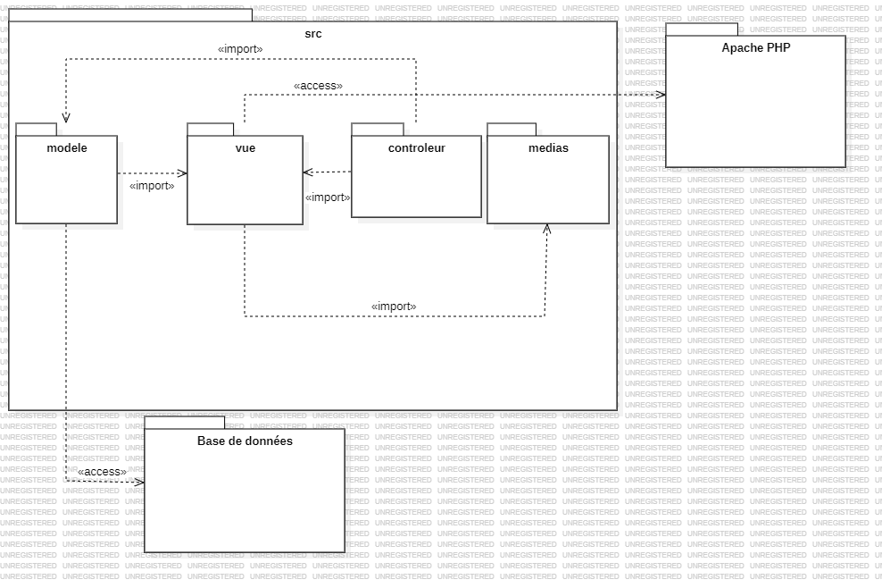
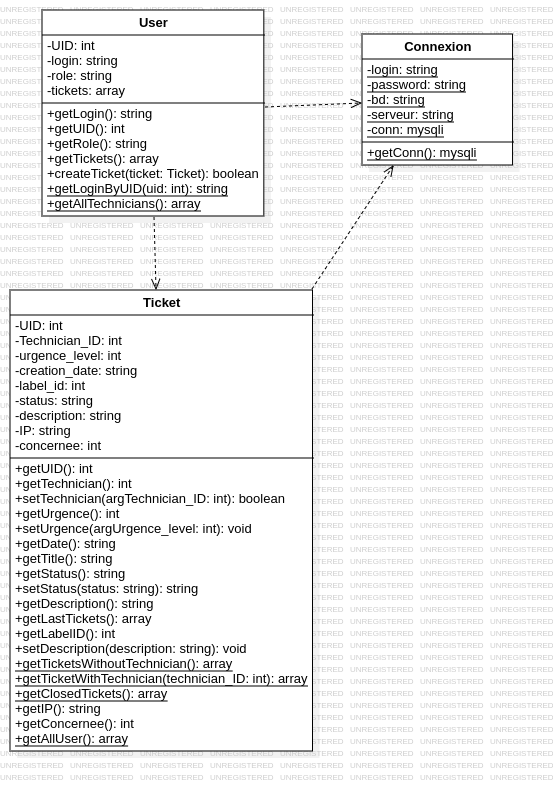

# SAE3 - Dossier de conception 

## <ins>Plan :</ins>
1) Introduction
2) Diagramme de package
3) Diagramme de composant connecteur
4) Diagramme d'objets
5) Conception MCD et MLD de la base de donnée
***

1) ### <ins>Introduction</ins>

Ce dossier de conception a pour but d'indiquer l'architechture/structure du projet dans le cas du diagramme de package , mais aussi de montrer le fonctionnement de notre projet comme le montre le diagramme de composant connecteur avec l'intéraction entre le serveur et notre programme.

2) ### <ins>Diagramme de package</ins>
Dans notre diagramme de package nous utilisons l'architechture MVC (Modèle Vue Controleur) :
* Notre vue stocke les pages HTML/PHP et les fiches de style.
* Notre modèle contient toute les fonctions qui intéragissent avec la base de donnée.
* Notre controleur contient des fonctions s'occupant des évenements sur l'interface graphique.
* Un dossier media stocke les images, vidéos et autres médias qui servent aux différentes composantes de la vue.  
Diagramme de package :
 

 
 
 
 
 
 
 
 
 
 
 
 
 
 
 
 
 
 
 
 
 
 
 
 
 
 
 

3) ### <ins>Diagramme de composant connecteur</ins>

Dans ce diagramme le Serveur Apache interprète le code sur les pages PHP pour le transformer en code HTML, puis le Navigateur web d'un utilisateur lambda interprète le code HTML de la page grâce aux requête que celui-ci envois au serveur.
  

Diagramme composant connecteur :

 
 
 
 
 
 
 
 
 
 
 
 
 
 
 
 
 
 

4) ### <ins>Diagramme d'objets</ins>

Voici le diagramme d'objets concernant notre code PHP.

 

5) ### <ins>Conception MCD et MLD de la base de donnée</ins>

Voici le MCD :

Voici le MLD correspondant : 
Ticket (<ins>Ticket_ID</ins>, #UID, #Technician_ID, urgence_level, #Label_ID, creation_date, status, description, #concernee, IP)
 
User (<ins>UID</ins>, role,  login, password) 
Label (<ins>Label_ID</ins>, name, archivé) 

**Remarque** : Ce dossier de conception est basé sur les informations fournies. Il pourrait être amené à être modifié à l'avenir.