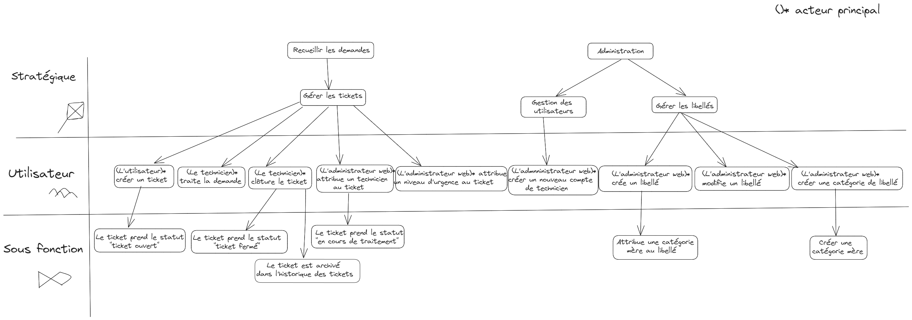

GRONDIN David 
CHOISY Alexis 
LÉAUTHAUD Matthieu 
MOUSSAMIH Elias 
DEGAT Teddy

# Recueil

## I. Chapitre 1 – Objectif et Portée

### (a) Portée et Objectifs Généraux

#### Portée
Le projet vise à concevoir et développer une application web en PHP et MySQL pour la gestion des demandes de dépannage des utilisateurs, y compris les professeurs, dans les salles machines. L'application sera hébergée sur un serveur web installé sur un Raspberry Pi 4, accessible en connexion SSH depuis les salles machines et en tunnel SSH depuis le réseau local à l'IUT.

#### Objectifs Généraux
Les objectifs généraux du projet sont de créer une plateforme fonctionnelle et sécurisée qui permettra la soumission, la gestion et le suivi des demandes de dépannage. Les fonctionnalités devront être accessibles à quatre types d'utilisateurs : administrateur système, administrateur web (technicien(s)), utilisateur inscrit et visiteur.

### (b) Les Intervenants

#### Concernés
- Administrateur Système
- Administrateur Web 
- Techniciens
- Utilisateur Inscrit
- Visiteur

### (c) Limites du Système

#### Inclus dans la Portée
- Création de comptes et authentification
- Soumission de demandes de dépannage
- Gestion des demandes par les utilisateurs
- Journal d'activité

#### En Dehors de la Portée
- Méthode de récupération de mot de passe
- Confirmation par e-mail
- Fonctionnalités de messagerie interne entre utilisateurs

## II. Chapitre 2 – Terminologie Employée / Glossaire

**Tableau de Bord**
     - *Définition* : Interface personnalisée pour les utilisateurs inscrits, affichant leurs demandes de dépannage ainsi que le statut de ces demandes.
  
**Journal d'Activité**
    - *Définition* : Un registre enregistrant les événements clés de l'application tels que la validation des tickets, les tentatives de connexion infructueuses, etc.

**Niveaux d'Urgence**
    - *Définition* : Une échelle définissant la priorité des demandes de dépannage, classées de 4 (faible) à 1 (urgent).

**Statut**
    - *Définition* : définit l'état d'un ticket : ouvert, en cours de traitement, fermé.

**Libellés**
    - *Définition* : Des étiquettes attribuées aux différents problèmes qui peuvent être rencontrés dans les salles informatiques, permettant de les catégoriser.

**Ticket de Dépannage**
    - *Définition* : Une entrée représentant une demande de dépannage spécifique, associée à un utilisateur et à un niveau d'urgence.

**Historique des Tickets Fermés**
- *Définition* : Un registre contenant les tickets de dépannage qui ont été résolus et fermés.

## III. Chapitre 3 – Les Cas d'Utilisation

<ins>Nom</ins> : Recueillir les demandes  
<ins>Contexte d'utilisation</ins> : Le but de est recueillir les demandes des utilisateurs et de les traiter afin de répondre à leurs exigences. 
<ins>Portée</ins> : Le site web  
<ins>Niveau</ins> : Stratégique  
<ins>Précondition</ins> : Aucune
<ins>Acteur principal</ins> : Tout les utilisateurs  
<ins>Intervenants et intérêt</ins> : Tout les utilisateurs 
<ins>Scénario</ins> :
* (1) Gérer les demandes

***

<ins>Nom</ins> : Gérer les tickets  
<ins>Contexte d'utilisation</ins> : Le but est de gérer les tickets c'est à dire de gérer la création par un utilisateur, et tout le processus qui suit sa création. 
<ins>Portée</ins> : Le site web  
<ins>Niveau</ins> : Stratégique  
<ins>Précondition</ins> : Recueillir les besoins 
<ins>Acteur principal</ins> : Tout les utilisateurs  
<ins>Intervenants et intérêt</ins> : Tout les utilisateurs 
<ins>Scénario</ins> :
* (1) L'utilisateur créer un ticket
* (2) L'administrateur web attribut un technicien au ticket
* (3) L'administrateur web attribut un niveau d'urgence au ticket
* (4) Le technicien traite la demande
* (5) Le technicien cloture le ticket

***

<ins>Nom</ins> : Créer un ticket  
<ins>Contexte d'utilisation</ins> : Le client créer et rédige un ticket afin de résoudre un problème. 
<ins>Portée</ins> : Le système de ticket  
<ins>Niveau</ins> : Utilisateur  
<ins>Précondition</ins> : Gérer les tickets 
<ins>Acteur principal</ins> : un utilisateur  
<ins>Intervenants et intérêt</ins> : un utilisateur 
<ins>Scénario</ins> :
* (1) L'utilisateur rédige son ticket
* (2) L'utilisateur envois son formulaire
* (3) Le ticket prend le statut "ticket ouvert"

***

<ins>Nom</ins> : Le technicien traite la demande  
<ins>Contexte d'utilisation</ins> : Le technicien résout le problème que l'utilisateur à rencontré. 
<ins>Portée</ins> : Le système de ticket  
<ins>Niveau</ins> : Utilisateur  
<ins>Précondition</ins> : Gérer les tickets 
<ins>Acteur principal</ins> : un technicien  
<ins>Intervenants et intérêt</ins> : un utilisateur et un technicien 
<ins>Scénario</ins> :
* (1) L'utilisateur rédige son ticket
* (2) L'utilisateur envois son formulaire
* (3) Le ticket prend le statut "ticket ouvert"

***

<ins>Nom</ins> : Le technicien clôture le ticket  
<ins>Contexte d'utilisation</ins> : Une fois la demande de l'utilisateur traitée le technicien clôt le ticket. 
<ins>Portée</ins> : Le système de ticket  
<ins>Niveau</ins> : Utilisateur  
<ins>Précondition</ins> : Gérer les tickets 
<ins>Acteur principal</ins> : un technicien  
<ins>Intervenants et intérêt</ins> : un utilisateur et un technicien 
<ins>Scénario</ins> :
* (1) Le ticket prend le statut "ticket fermé"
* (2) Le ticket est archivé dans l'historique des tickets

***

<ins>Nom</ins> : L'administrateur web attribue un technicien au ticket  
<ins>Contexte d'utilisation</ins> : Un technicien se voit attribué un ticket qu'il va devoir traiter. 
<ins>Portée</ins> : Le système de ticket  
<ins>Niveau</ins> : Utilisateur  
<ins>Précondition</ins> : Gérer les tickets 
<ins>Acteur principal</ins> : L'administrateur web  
<ins>Intervenants et intérêt</ins> : un utilisateur, un administrateur web ainsi qu'un technicien 
<ins>Scénario</ins> :
* (1) Un technicien est assigné au ticket
* (2) Le ticket prend le statut "en cours de traitement"

***

<ins>Nom</ins> : L'administrateur web attribue un niveau d'urgence au ticket  
<ins>Contexte d'utilisation</ins> : Un administrateur web attribue un niveau d'urgence plus ou moins important à un ticket pour que celui-ci soit réglé plus ou moins vite. 
<ins>Portée</ins> : Le système de ticket  
<ins>Niveau</ins> : Utilisateur  
<ins>Précondition</ins> : Gérer les tickets 
<ins>Acteur principal</ins> : L'administrateur web  
<ins>Intervenants et intérêt</ins> : un utilisateur, un administrateur web ainsi qu'un technicien 
<ins>Scénario</ins> :
* (1) Le ticket prend un niveau d'urgence plus ou moins important
* (2) Le ticket est traité plus ou moins vite

***

<ins>Nom</ins> : Le ticket prend le statut "ticket ouvert"  
<ins>Contexte d'utilisation</ins> : Une fois le ticket ouvert un technicien lui sera attribué. 
<ins>Portée</ins> : Le système de ticket  
<ins>Niveau</ins> : Sous fonction  
<ins>Précondition</ins> : Créer un ticket 
<ins>Acteur principal</ins> : le ticket  
<ins>Intervenants et intérêt</ins> : un utilisateur, un technicien, un ticket 

***

<ins>Nom</ins> : Le ticket prend le statut "ticket fermé"  
<ins>Contexte d'utilisation</ins> : Une fois le tâche du technicien terminée il clôt le ticket. 
<ins>Portée</ins> : Le système de ticket  
<ins>Niveau</ins> : Sous fonction  
<ins>Précondition</ins> : Le technicien clôture le ticket 
<ins>Acteur principal</ins> : le ticket  
<ins>Intervenants et intérêt</ins> : un utilisateur, un technicien, un ticket 

***

<ins>Nom</ins> : Le ticket est archivé dans l'historique des tickets  
<ins>Contexte d'utilisation</ins> : Une fois le ticket clôturé il est archivé dans l'historique des tickets. 
<ins>Portée</ins> : Le système d'historique des tickets fermés  
<ins>Niveau</ins> : Sous fonction  
<ins>Précondition</ins> : Le technicien clôture le ticket 
<ins>Acteur principal</ins> : le ticket  
<ins>Intervenants et intérêt</ins> : un technicien, un utilisateur, un ticket 

***

<ins>Nom</ins> : Le ticket prend le statut "en cours de traitement"  
<ins>Contexte d'utilisation</ins> : Une fois le technicien atribué le statut du ticket change. 
<ins>Portée</ins> : Le système de ticket  
<ins>Niveau</ins> : Sous fonction  
<ins>Précondition</ins> : L'administrateur web attribue un technicien au ticket 
<ins>Acteur principal</ins> : le ticket  
<ins>Intervenants et intérêt</ins> : un utilisateur, un technicien, un ticket 

***

<ins>Nom</ins> : Administration 
<ins>Contexte d'utilisation</ins> : Le but est d'administrer les différents libellés ainsi que créer des comptes technicien. 
<ins>Portée</ins> : Le site web  
<ins>Niveau</ins> : Stratégique  
<ins>Précondition</ins> : Aucune
<ins>Acteur principal</ins> : L'administrateur web  
<ins>Intervenants et intérêt</ins> : Les libellés, les techniciens, les administrateurs web 
<ins>Scénario</ins> :
* (1) Gérer les utilisateurs
* (2) Gérer les libellés

***

<ins>Nom</ins> : Gérer les utilisateurs 
<ins>Contexte d'utilisation</ins> : Le but est de gérer les différents utilisateurs. 
<ins>Portée</ins> : Le site web  
<ins>Niveau</ins> : Stratégique  
<ins>Précondition</ins> : Administration 
<ins>Acteur principal</ins> : L'administrateur web  
<ins>Intervenants et intérêt</ins> : Les techniciens, les administrateurs web 
<ins>Scénario</ins> :
* (1) L'administrateur crée un nouveau compte de technicien

***

<ins>Nom</ins> : L'administrateur web créer un nouveau compte de technicien 
<ins>Contexte d'utilisation</ins> : Un nouveau compte de technicien est crée. 
<ins>Portée</ins> : Le site web  
<ins>Niveau</ins> : Utilisateur  
<ins>Précondtion</ins> : Gérer les utilisateurs 
<ins>Acteur principal</ins> : L'administrateur web  
<ins>Intervenants et intérêt</ins> : Les techniciens, les administrateurs web 
<ins>Scénario</ins> :
* (1) Le compte est créé dans la base de donnée

***

<ins>Nom</ins> : Gérer les libellés 
<ins>Contexte d'utilisation</ins> : Les libellés peuvent être modifié ou créer par l'administrateur web. 
<ins>Portée</ins> : Le site web  
<ins>Niveau</ins> : Stratégique  
<ins>Précondition</ins> : Administration 
<ins>Acteur principal</ins> : L'administrateur web  
<ins>Intervenants et intérêt</ins> : Les administrateurs web, les libellés 
<ins>Scénario</ins> :
* (1) L'administrateur web crée un libellé

<ins>Liste des variantes</ins> : 
* (a) L'administrateur web modifie un libellé
* (b) L'administrateur web crée une catégorie de libellé

***

<ins>Nom</ins> : L'administrateur web crée un libellé 
<ins>Contexte d'utilisation</ins> : Un libellé est créer et pourra être associer à des tickets. 
<ins>Portée</ins> : Le système de libellé  
<ins>Niveau</ins> : Utilisateur  
<ins>Précondition</ins> : Gérer les libellés 
<ins>Acteur principal</ins> : L'administrateur web  
<ins>Intervenants et intérêt</ins> : Les administrateurs web, les libellés 
<ins>Scénario</ins> :
* (1) Attribue une catégorie mère au libellé

***

<ins>Nom</ins> : L'administrateur web modifie un libellé 
<ins>Contexte d'utilisation</ins> : L'administrateur web modifie le nom d'un libellé. 
<ins>Portée</ins> : Le système de libellé  
<ins>Niveau</ins> : Utilisateur  
<ins>Précondition</ins> : Gérer les libellés 
<ins>Acteur principal</ins> : L'administrateur web  
<ins>Intervenants et intérêt</ins> : Les administrateurs web, les libellés 

***

<ins>Nom</ins> : L'administrateur web crée une catégorie de libellé 
<ins>Contexte d'utilisation</ins> : L'administrateur web créer une nouvelle catégorie de libellé dans le but de proposer plus de précision sur les prochains ticket. 
<ins>Portée</ins> : Le système de libellé  
<ins>Niveau</ins> : Utilisateur  
<ins>Précondition</ins> : Gérer les libellés 
<ins>Acteur principal</ins> : L'administrateur web  
<ins>Intervenants et intérêt</ins> : Les administrateurs web, les libellés 
<ins>Scénario</ins> :
* (1) Créer une catégorie mère

***

<ins>Nom</ins> : Attribue une catégorie mère au libellé 
<ins>Contexte d'utilisation</ins> : L'administrateur web attribue une "catégorie" au libellé 
<ins>Portée</ins> : Le système de libellé  
<ins>Niveau</ins> : Sous fonction  
<ins>Précondition</ins> : L'administrateur web crée un libellé 
<ins>Acteur principal</ins> : L'administrateur web  
<ins>Intervenants et intérêt</ins> : Les administrateurs web, les libellés 

***

<ins>Nom</ins> : Créer une catégorie mère 
<ins>Contexte d'utilisation</ins> : L'administrateur web ajoute une "catégorie mère" pour y associer un ou plusieurs libellé 
<ins>Portée</ins> : Le système de libellé  
<ins>Niveau</ins> : Sous fonction  
<ins>Précondition</ins> : L'administrateur web crée une catégorie de libellé 
<ins>Acteur principal</ins> : L'administrateur web  
<ins>Intervenants et intérêt</ins> : Les administrateurs web, les libellés 

Voici le diagramme des cas d'utilisation :

## IV. Chapitre 4 – La Technologie Employée

### (a) Exigences Technologiques

- Langages : PHP, MySQL
- Serveur Web : Apache
- Plateforme : Raspberry Pi 4
- Protocoles : SSH, HTTP
- Materiel : Carte SD

### (b) Interfaçage avec d'Autres Systèmes

Ce système sera stocké sur le Raspberry Pi 4 et sera interactif avec l'utilisateur via l'application web.

## V. Chapitre 5 – Autres Exigences

### (a) Processus de Développement

#### Participants au Projet
- Équipe de Développement : Degat Teddy, Choisy Alexis, Moussamih Elias, Leauthaud Matthieu, Grondin David
- Le client : M Hoguin  

#### Valeurs à Privilégier
- Sécurité
- Fiabilité
- Simplicité d'utilisation
- Accessibilité 

#### Retours sur le Projet
- Feedback des utilisateurs
- Suivi de l'avancement par les commanditaires

#### Achats et Construction
- Développement de l'application (Construction)
- Éventuels achats de licences ou ressources

#### Autres Exigences du Processus
- Tests approfondis
- Installation sur le serveur
- Configuration de la sécurité

#### Dépendances du Projet
- Disponibilité des ressources matérielles et logicielles

### (b) Règles Métier

#### Gestion des Libellés
- Problème de Mot de Passe : Ouvert, En Cours, Fermé

### (c) Performances

#### Niveaux d'Urgence
- 4 (Faible), 3 (Moyen), 2 (Important), 1 (Urgent)

### (d) Opérations, Sécurité, Documentation

#### Opérations
- Enregistrement des activités dans le journal

#### Sécurité
- Tentatives de Connexion Ratées au moins 3 fois en 10 minutes : Bannissement temporaire de l'adresse IP

#### Documentation
- Documentation Technique pour le Développement et la Maintenance

### (e) Utilisation et Utilisabilité

#### Interface Utilisateur
- Interface Intuitive et Facile à Utiliser

### (f) Maintenance et Portabilité

#### Maintenance
- Suivi des Tickets Fermés (Historique)

#### Portabilité
- Accès en Connexion SSH depuis les Salles Machines

### (g) Questions Non Résolues ou Reportées à Plus Tard

- Des doutes sur une conception durable de la base de donnée donc celle-ci serait peut être amenée à être modifiée à l'avenir

## VI. Chapitre 6 – Recours Humain, Questions Juridiques, Politiques, Organisationnelles

### (a) Recours Humain

#### Fonctionnement du Système
- Équipe de Développement
- Administrateurs Système et Web
- Utilisateurs

### (b) Exigences Juridiques et Politiques

#### Confidentialité
- Respect de la Confidentialité des Données Utilisateurs
- Tout est expliqué clairement dans notre rendu de Droit et notre charte informatique

### (c) Conséquences Humaines

#### Formation
- Besoins en Formation pour les Utilisateurs

### (d) Besoins en Formation

#### Formation Technique pour l'Équipe de Développement et les Administrateurs

### (e) Hypothèses et Dépendances Humaines

#### Environnement Humain
- Disponibilité des Utilisateurs pour Soumettre les Demandes

---

**Remarque :** Ce recueil des besoins est basé sur les informations fournies. Il peut être amené à être modifié à l'avenir.